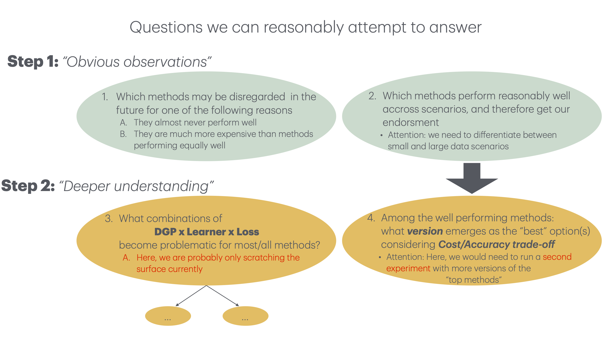

```{r setup, include=FALSE}
library(here)
library(dplyr)
library(data.table)
library(DT)
knitr::opts_chunk$set(echo = TRUE)
source("../../shiny_app_old/setup.R")
source("MetaInfo.R")
dgps <- readr::read_csv("../../shiny_app/dgps.csv")


Suspicious_DGPS_ID <- Suspicious_DGPS %>%
  group_by(size,inducer,target,loss) %>%
  mutate(ID = cur_group_id(),
         loss=unlist(loss),
         size=unlist(size),
         inducer=unlist(inducer),
         target=unlist(target)) %>%
  ungroup()
```

# Overview of questions for empirical section
```{r, echo=FALSE}

```

# Step 1: Good Methods
For all n:

  1. Bayle
  2. corrected t-test
  3. holdout 
  
Additionally for small n:

  4. conservative z-test
  5. (nested CV) -- _very_ expensive

# Step 2, Q3: first inquiries

## Is it just regression? {.tabset}

### Never suspicious
The following DGPS are never suspicious - note that the `higgs` data set is unproblematic despite regression being applied.
```{r,echo=FALSE}
knitr::kable(dgps[which(dgps$name_short%in%never_sus),c("name","task_type")])
```
<br /><br /><br />

---


### regularly suspicious
The following DGPS are regularly suspicious in the sense that _even the coverage of well-performing methods "Bayle" and "corrected-t" falls beneath 0.5.
```{r,echo=FALSE}
display_sus_tt <- dgps[which(dgps$name_short%in%sometimes_sus),c("name","name_short","task_type")]
knitr::kable(display_sus_tt)
```

So it's mainly regression, but not exclusively... what's more:

```{r,echo=FALSE}
display_not_only_reg <- Suspicious_DGPS_ID[which(Suspicious_DGPS$name%in%display_sus_tt$name_short[which(display_sus_tt$task_type=="classif")] & Suspicious_DGPS$name!="none"),-8] %>%
  mutate(loss=replace(loss,which(loss=="standard:L2/0-1"),"Zero_One"))
datatable(display_not_only_reg, options = list(pageLength = 15, autoWidth = TRUE))
```


```{r}
#huh <- Suspicious_DGPS_ID[which(Suspicious_DGPS_ID$name%in%display_sus_tt$name_short & Suspicious_DGPS_ID$name!="none" & Suspicious_DGPS_ID$value!=0.9 & Suspicious_DGPS_ID$name %in% #c("bates_regr_100","bates_regr_20","friedman1")),-8]
#datatable(huh, options = list(pageLength = 20, autoWidth = TRUE))
```

<br /><br /><br />

---


# Some summaries {.tabset}

## DGPs
```{r,echo=FALSE}
datatable(dgps, options = list(pageLength = 10, autoWidth = TRUE))
```
<br /><br /><br />

---

## 64 Plots
The discussed Plots are all in a [google drive](https://drive.google.com/drive/folders/1HldNnEloEfEUW-NcIKx7KRNFhIEhW1tr)

<br /><br /><br />

---