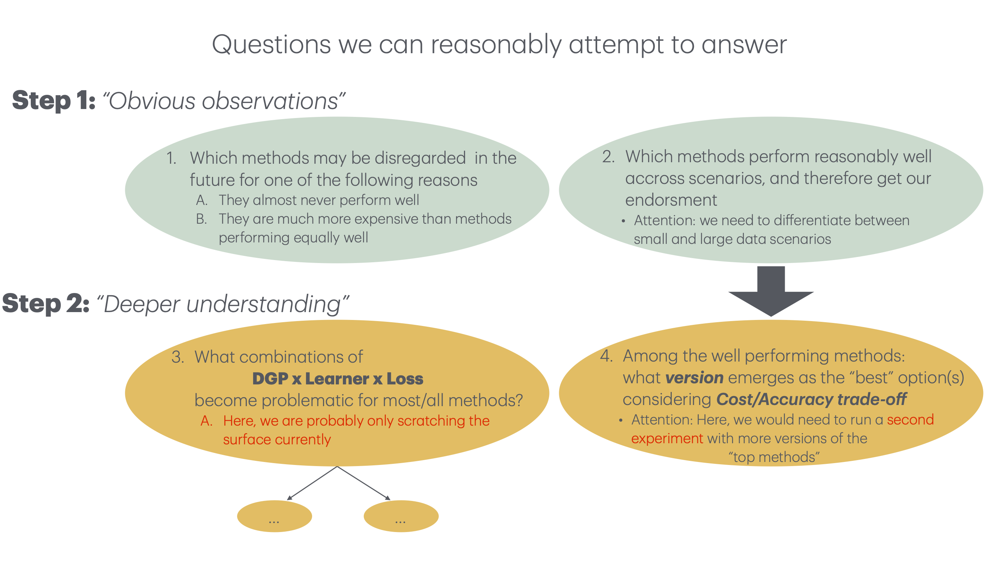

```{r setup, include=FALSE}
library(here)
library(dplyr)
library(data.table)
library(DT)
knitr::opts_chunk$set(echo = TRUE)
source("../../shiny_app_old/setup.R")
load("../Data/Suspicious_DGPS.RData")
dgps <- readr::read_csv("../../shiny_app_old/dgps.csv")

Suspicious_DGPS_ID <- Suspicious_DGPS %>%
  group_by(size,inducer,target,loss) %>%
  mutate(ID = cur_group_id()) %>%
  ungroup()
```

# Overview of questions for empirical section
```{r, echo=FALSE}

```

# Good Methods:
For small n:

  * conservative z-test
  * Bayle
  * corrected t-test
  * holdout and
  * (nested CV) 


For large n:

  * Bayle
  * holdout
  * corrected t-test


# 64 Plots
The discussed Plots are all in a [google drive](https://drive.google.com/drive/folders/1HldNnEloEfEUW-NcIKx7KRNFhIEhW1tr)

## Some Summaries of suspicious DGPs (excluding chen_10_NULL){.tabset}

### Never suspicious
```{r}
## DGPs that are never suspicious
setdiff(DGPS,c(setdiff(levels(as.factor(Suspicious_DGPS$name)),"none"),"chen_10_null"))
```

```{r}
NeverSus <- Suspicious_DGPS_ID %>%  group_by(ID) %>%
  mutate(all_specific = all(name == "none")) %>%
  ungroup()
NeverSus <- NeverSus[which(NeverSus$all_specific==TRUE),c(1,3)] %>% distinct()
```

```{r,echo=FALSE}
datatable(NeverSus, options = list(pageLength = 10, autoWidth = TRUE))
```

<br /><br /><br />

---

### Suspicious b/c Coverage for solid methods
```{r}
CoverageSus <- Suspicious_DGPS_ID[which(Suspicious_DGPS_ID$reason=="coverage< cutoff (value) for solid methods" ),c(1,3,5)]%>% distinct()

cat("suspicious DGPS:\n")
levels(as.factor(unlist(CoverageSus$name)))
cat("suspicious learners:\n")
levels(as.factor(unlist(CoverageSus$inducer)))
cat("suspicious Losses:\n")
levels(as.factor(unlist(CoverageSus$loss)))
```

```{r,echo=FALSE}
datatable(CoverageSus, options = list(pageLength = 10, autoWidth = TRUE))
```
<br /><br /><br />

---

### Suspicious b/c holdout behavior
```{r}
HoldoutSus <- Suspicious_DGPS_ID[which(Suspicious_DGPS_ID$reason=="coverage< cutoff (value) for holdout_90 and size 10000"),c(1,3,5)]%>% distinct()

cat("suspicious DGPS:\n")
levels(as.factor(unlist(HoldoutSus$name)))
cat("suspicious learners:\n")
levels(as.factor(unlist(HoldoutSus$inducer)))
cat("suspicious Losses:\n")
levels(as.factor(unlist(HoldoutSus$loss)))
```

```{r,echo=FALSE}
datatable(HoldoutSus, options = list(pageLength = 10, autoWidth = TRUE))
```
<br /><br /><br />

---

# DGP Summary
```{r,echo=FALSE}
datatable(dgps, options = list(pageLength = 10, autoWidth = TRUE))
```

# Suspicious DGPS data
```{r,echo=FALSE}
datatable(Suspicious_DGPS, options = list(pageLength = 10, autoWidth = TRUE))
```
